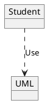

# Курс по архитектуре от `Слерм`
#course #architecture

### Изоляция

==Изоляция== - Исключение влияние одной части кода на другую. Изодяция предполагает разбиение кода на компоненты, зависимость которых друг от друга находятся под строгим контролем.

###### Преимущества
- Структурирование кода
- Независимость разработки, развертывания и тестирования
- Скрывает сложности реализации

### Модульность и функциональная расширяемость

Модульное программирование - метод проектирования программного обеспечения, которое подчеркивает разделение функциональности программы на независимые, взаимозаменяемые модули, так что каждый содержит все необходимые для выполнения только одного аспекта желаемой функциональности.

### Сопровождаемость
#### Характеризуется
- Изменяемость
- Анализируемость
- Модульность/повторное использование
- Тестируемость

==Компоненты== - единицы развертывания приложения. Правильно спроектированные компоненты позволяют разрабатывать и разыертывать их независимо

#### Связность компонентов

- Общие причины изменений
- Совместное использование
- Совместный выпуск

## UML  Диаграммы

#### Отношения

==Зависимость== - это наиболее общий тип отношений между двумя сущностями. Отношение зависимости указываетна то, что изменение независимой сущности каким-то образом влияет на завимимую сущность



==Ассоциация== - это наиболее часто используемый тип отношений между сущностями. Отношение ассоциации имеет место, если одна сущность непосредственно связана с другой или другими

```plantuml
object Гений
object Slurm

Гений --> Slurm
```

==Обобщение== - это отношение между двумя сущностями, одна из которых является (специализированным) случаем другой. В UML отношение обобщения подразумевает выполнение принципа подстановочности
```plantuml
object Программист
object Человек
Программист --|> Человек
```

==Реализация== - это семантическая связь между классами, когда один из них определяет соглашение(контракт), которого второй обязан придерживаться
```plantuml
object Student
object IStudent
Student ..|> IStudent
```

```
--------> Ассоциация
........> Зависимость
-------|> Настледование/обобщение
.......|> Реализация
--------o Агрегация
--------* Композиция
```

#### Диаграммы классов

##### Ассоциация
```plantuml
class Client{}
class Server{}

Client "*"-->"1..*" Server
```

##### Наследование

```plantuml
class Person{}
class Student{}
class Speaker{}

Student --|> Person
Speaker --|> Person
```

##### Реализация
```plantuml
class ConsoleWriter
class ConsoleReader
class ConsoleIO

ConsoleIO ..|> ConsoleWriter
ConsoleIO ..|> ConsoleReader
```

##### Агрегация
Отношение агрегации между двумя классами показывает, что один из них включает в себя другой класс в качестве составной части. При этом класс-часть может и существовать обособленно от класса-целого

```plantuml
class Library{}
class Book{}
class Newspaper{}

Book --o Library
Newspaper --o Library
```

##### Композиция
Отношение композиции является частным случаем отношения агрегации.Однако у него есть одно отличие - класс-часть, которые он соединяет с классом-целым, не могут существовать обособленно


```plantuml
class Book{}
class Topic{}
class Page{}

Topic --* Book
Page --* Book
```

## ==SOLID==

### Single Responsibility principle (SRP)

Класс должен иметь лишь одну причину для изменений
*A class should have one, and only one, reason to change*

Модуль должен отвечать перед одним и только одним актором
*A module should be responsible to one, and only one, actor*

### Паттерны

#### Порождающие паттерны

==Порождающие паттерны== - это паттерны которые абстрагируют процесс создания

##### Фабричный метод
```plantuml
class Creator{
	+ someFunc()
	+ createProduct(): Product
}

class ConcreteCretor1{
	+ createProduct(): Product
}

class ConcreteCretor2{
	+ createProduct(): Product
}

class ConcreteProduct2{
}

class ConcreteProduct1{
}

interface Product{
	+ doSmth()
}

Creator ..> Product
ConcreteCretor1 --|> Creator
ConcreteCretor2 --|> Creator
ConcreteCretor1 ..> ConcreteProduct1: create
ConcreteCretor2 ..> ConcreteProduct2: create
ConcreteProduct1 ..> Product
ConcreteProduct2 ..> Product
```


### Абстрактная фабрика

```plantuml
class Client{
	+ factory: AbstractFactory
}

class ConcreteFactory1{
	+ createProductA(): ProductA
	+ createProductB(): ProductB
}
class ConcreteFactory2{
	+ createProductA(): ProductA
	+ createProductB(): ProductB
}

interface AbstractFactory{
	+ createProductA(): ProductA
	+ createProductB(): ProductB
}

class ConcreteProductA1{}
class ConcreteProductA2{}
interface AbstractProductA{}

class ConcreteProductB1{}
class ConcreteProductB2{}
interface AbstractProductB{}

Client --> AbstractFactory
ConcreteFactory1 ..|> AbstractFactory
ConcreteFactory2 ..|> AbstractFactory

ConcreteFactory1 ..> ConcreteProductA1
ConcreteFactory1 ..> ConcreteProductB1
ConcreteFactory2 ..> ConcreteProductA2
ConcreteFactory2 ..> ConcreteProductB2

ConcreteProductA1 ..|> AbstractProductA
ConcreteProductA2 ..|> AbstractProductA
ConcreteProductB1 ..|> AbstractProductB
ConcreteProductB2 ..|> AbstractProductB
```

###### Плюсы
- Гарантирует сочетаемость создаваемых продуктов
- Выделяет код производства продуктов в одно место, упрощая поддержку кода
- Упрощает добавление новых продуктов в программу
###### Минусы
- Требует наличия всех типов продуктов в каждой реализации

### Строитель
```plantuml
interface Builder{
	+ reset()
	+ buildPart1()
	+ buildPart2()
	+ getResult()
}

class Client{
 - builder: Builder
}

class ConcreteBuilder1{
	+ reset()
	+ buildPart1()
	+ buildPart2()
	+ getResult(): Proudct1
}

class ConcreteBuilder2{
	+ reset()
	+ buildPart1()
	+ buildPart2()
	+ getResult(): Proudct2
}

class Product1{}
class Product2{}

Client::build --> Builder
ConcreteBuilder1 ..|> Builder
ConcreteBuilder2 ..|> Builder
ConcreteBuilder1 --> Product1
ConcreteBuilder1 --> Product2
```

###### Плюсы
- Позволяет использовать один и тот же код для создания различных продуктов
- Изолирует сложный код сборки продукта от его основной бизнес логики
- Позволяет создавать продукты итерактивно
###### Минусы
- Builder жустко связан со структурой продукта, что усложняет изменение структуры продукта

### Прототип

```plantuml
interface Prototype{
	+ clone()
}
class ConcretePrototype{
	+ clone()
}
class Client{}

Client --> Prototype
ConcretePrototype ..|> Prototype
```

###### Плюсы
- Ускоряет создание объектов
- Общий интерфейс клонирования объектов
- Меньше повторяющегося кода инициализации объектов
###### Минусы
- Сложности при клонировании объектов, имеющих ссылки на другие