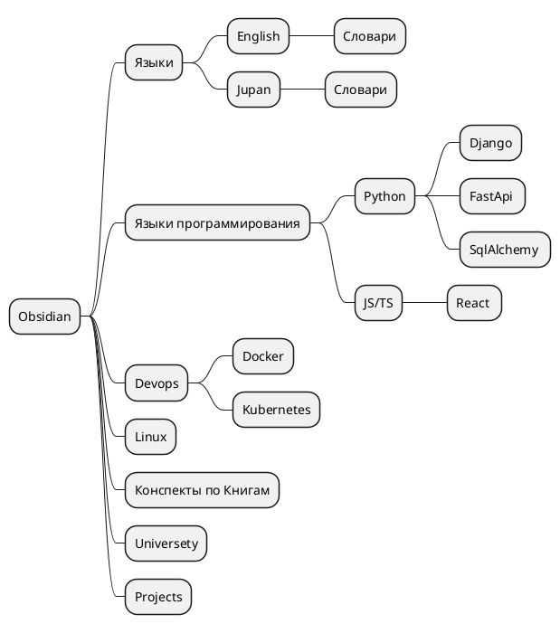

# Карта знаний

```plantuml
@startmindmap
* Obsidian
** Языки
*** English
**** Словари
*** Jupan
**** Словари
** Языки программирования
*** Python
**** Django
**** FastApi 
**** SqlAlchemy 
*** JS/TS
**** React 
** Devops
*** Docker
*** Kubernetes
** Linux
** Конспекты по Книгам
** Universety
** Projects
@endmindmap
```
