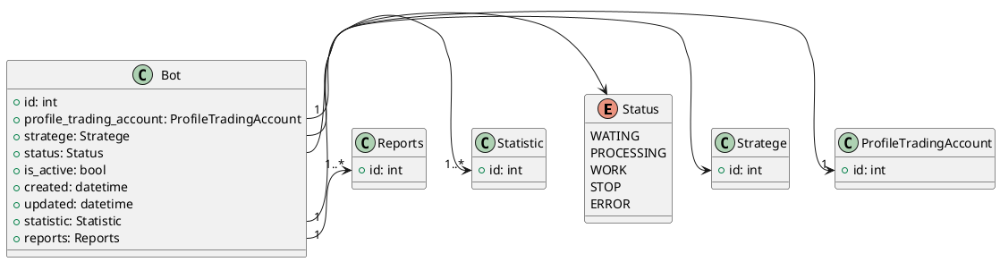

#### Class Diagram

#### Business logic 

1. Основная сущность которая видна пользователю и с которой пользователь взамодействует
2. Пользователь может создавать определенное кол-во ботов
3. К боту призвязывается акаунт платформы пользователя 
4. Бот может быть только определенного типа при создании нужно проверить правильного ли типа бот
5. К боту привязывается стратеги соглано которой он будет торговать
6. Добавить уведомления пользователю при создании бота
7. Пользователь может сменить акаунт и стратегию у бота
